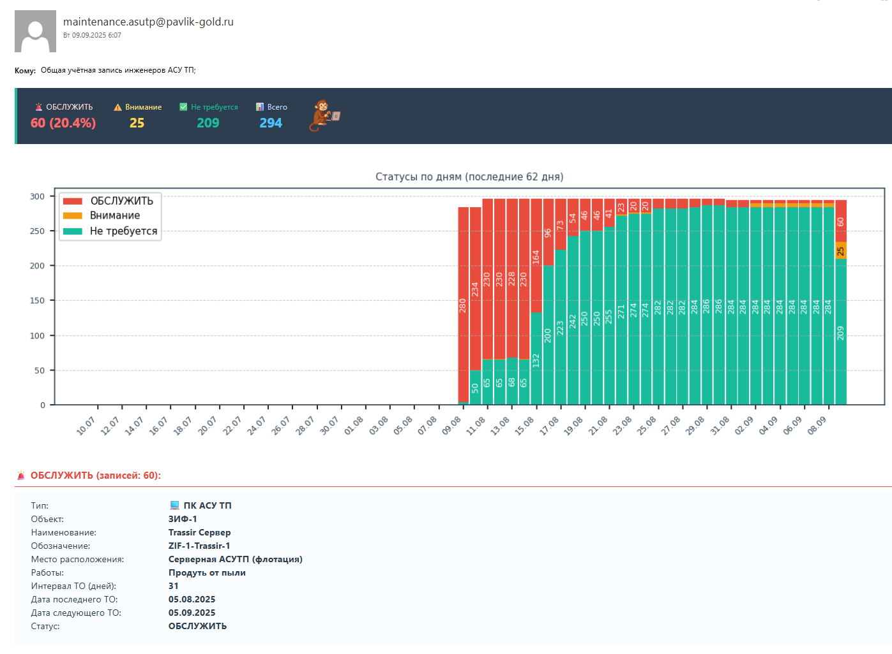

# 🛠️ Система уведомлений о техническом обслуживании оборудования АСУТП

[](https://www.python.org/downloads/)
[](https://opensource.org/licenses/MIT)


Автоматизированная система мониторинга и уведомлений о сроках технического обслуживания оборудования АСУТП (Автоматизированные системы управления технологическими процессами).



## 📋 Описание

Данная система предназначена для:
- Автоматического отслеживания сроков технического обслуживания оборудования
- Формирования и отправки уведомлений по электронной почте
- Визуализации статистики обслуживания
- Ведения истории выполненных работ

Система анализирует данные из Excel-таблицы и автоматически отправляет уведомления о:
- 🚨 **Срочном обслуживании** - оборудование требует немедленного внимания
- ⚠️ **Приближающемся обслуживании** - сроки подходят к концу
- ✅ **Нормальном состоянии** - все оборудование обслужено вовремя

## 🎯 Основные возможности

### 🔍 Мониторинг оборудования
- Отслеживание персональных компьютеров АСУ ТП
- Мониторинг шкафов автоматики АСУ ТП
- Автоматическое определение статуса оборудования

### 📧 Система уведомлений
- Автоматическая отправка email-уведомлений
- Цветовая индикация срочности работ
- Подробная информация о каждом элементе оборудования

### 📊 Визуализация данных
- Графики статусов обслуживания за последние 62 дня
- Сводная статистика по периодам
- Процентное соотношение обслуженного оборудования

### 📈 Статистика и аналитика
- История обслуживания за последние 120 дней
- Анализ по дням, неделям и месяцам
- Отслеживание динамики выполнения работ

## 📁 Структура проекта

```
maintenance_alert/
├── maintenance_alert.py          # Основной скрипт
├── Обслуживание ПК и шкафов АСУТП.xlsx  # Таблица с данными
├── data/
│   └── maintenance_alert_history.json       # История обслуживания
└── README.md
```

## 🚀 Установка и настройка

### Требования
- Python 3.6 или выше
- Windows OS (для работы с Excel и Task Scheduler)
- Доступ к SMTP серверу

### Установка зависимостей

```bash
pip install pandas openpyxl matplotlib
```

### Настройка Excel-таблицы

Таблица должна содержать следующие колонки:
1. №
2. Объект
3. Наименование
4. Обозначение
5. Место расположения
6. Интервал ТО (дней)
7. Напоминание (за дней)
8. Дата последнего ТО
9. Дата следующего ТО
10. Статус

### Настройка SMTP

В скрипте необходимо настроить параметры SMTP-сервера:
```python
SMTP_SERVER = "your-smtp-server.com"
SMTP_PORT = 25
SENDER_EMAIL = "maintenance@yourcompany.com"
```

### Настройка получателей

```python
RECIPIENTS = [
    "recipient1@company.com",
    "recipient2@company.com",
    # Добавьте нужные адреса
]
```

## ⚙️ Автоматический запуск

Для автоматического ежедневного запуска рекомендуется использовать Windows Task Scheduler:

1. Откройте Планировщик заданий
2. Создайте новую задачу
3. Настройте запуск по расписанию (ежедневно)
4. Укажите путь к скрипту: `python path/to/maintenance_alert.py`

## 📊 Формат данных

### Статусы оборудования
- **СРОЧНО** - требуется немедленное обслуживание
- **Внимание** - приближается срок обслуживания
- **В норме** - оборудование обслужено

### Структура JSON-конфигурации
```json
{
  "maintenance_history": [
    {
      "date": "2025-08-18",
      "total_equipment": 45,
      "ok": 38,
      "urgent": 2,
      "warning": 5,
      "timestamp": "2025-08-18T09:00:00"
    }
  ],
  "last_update": "2025-08-18T09:00:00",
  "version": "1.1.2"
}
```

## 🎨 Особенности интерфейса

### Email-уведомления
- Цветовая кодировка статусов
- Эмодзи для быстрой идентификации типов оборудования:
  - 💻 Персональные компьютеры
  - 🗄 Шкафы автоматики
- Чередующийся фон для лучшей читаемости
- Встроенные диаграммы статистики

### Визуализация
- Столбчатая диаграмма с тремя уровнями:
  - Зеленый: В норме
  - Желтый: Внимание
  - Красный: Срочно

## 🔧 Технические детали

### Поддерживаемые форматы Excel
- .xlsx (рекомендуется)
- Совместимость с Excel 2007+

### Логирование
Система ведет подробное логирование в консоль:
```
🚀 ПРОГРАММА ЗАПУЩЕНА
Читаем лист: ПК АСУ ТП
  Найдено СРОЧНО: 2, Внимание: 5
📊 ОБНОВЛЕНИЕ СТАТИСТИКИ ОБСЛУЖИВАНИЯ
✅ Запись за 18.08.2025 добавлена: 38 обслужено
```

## 📈 Статистика обслуживания

Система автоматически собирает статистику:
- Ежедневное количество обслуженного оборудования
- Динамика по периодам (день, неделя, месяц)
- Сравнение с предыдущими периодами
- Процентное выполнение плана обслуживания

## 🛡️ Безопасность

- Все данные хранятся локально
- Конфигурационные файлы в формате JSON
- Нет передачи данных в интернет
- SMTP-авторизация через локальный сервер

## 📝 Лицензия

Этот проект лицензирован под MIT License - смотрите файл [LICENSE](LICENSE) для подробностей.

## 👨‍💻 Автор

**Артемий Семёнов**

🌐 [GitHub Profile](https://github.com/SemonoffArt)   
🌐 [https://semonoffart.github.io/](https://semonoffart.github.io/)

## 🙏 Благодарности

- Спасибо команде АСУТП за вдохновение
- Благодарим всех, кто участвовал в тестировании
- LLM за вайбкодинг

## 📞 Поддержка

Если у вас есть вопросы или предложения, создайте issue в репозитории или свяжитесь по email: semonoff@gmail.com