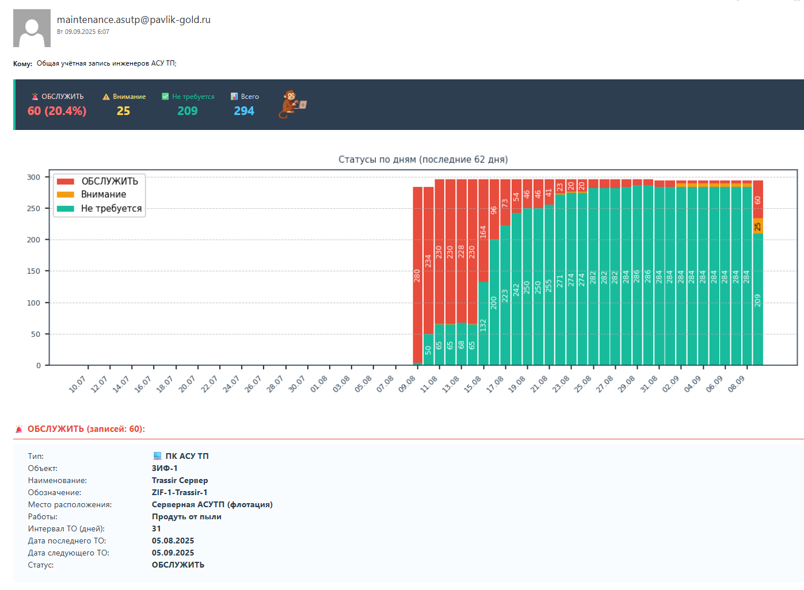

# 🛠️ Система уведомлений о техническом обслуживании оборудования АСУТП

[](https://www.python.org/downloads/)
[](https://opensource.org/licenses/MIT)


Автоматизированная система мониторинга и уведомлений о сроках технического обслуживания оборудования АСУТП (Автоматизированные системы управления технологическими процессами) с веб-интерфейсом для управления задачами обслуживания и ведением журнала выполненных работ.



## 📋 Описание

Данная система предназначена для:
- **Веб-интерфейса** для мониторинга и управления задачами обслуживания в реальном времени
- Автоматического отслеживания сроков технического обслуживания оборудования
- Формирования и отправки уведомлений по электронной почте
- Визуализации статистики обслуживания с интерактивными графиками
- Ведения истории выполненных работ и автоматического создания резервных копий

Система анализирует данные из Excel-таблицы и автоматически отправляет уведомления о:
- 🚨 **Срочном обслуживании** - оборудование требует немедленного внимания
- ⚠️ **Приближающемся обслуживании** - сроки подходят к концу
- ✅ **Нормальном состоянии** - все оборудование обслужено вовремя

## 🎯 Основные возможности

### 🌐 Веб-интерфейс
- **Интерактивный дашборд** с реал-тайм статусом всего оборудования
- **Фильтрация по объекту, статусу и обозначению** для быстрого поиска
- **Отметка "Обслужено"** прямо из браузера с автоматическим обновлением Excel **и мгновенной записью в журнал**
- **Массовое обслуживание** - отметка нескольких единиц оборудования одним кликом
- **Журнал обслуженного оборудования** — автоматическое отслеживание всех изменений дат ТО с дедупликацией
- **Доступ из сети** - работа с приложением с любого ПК в локальной сети
- **Загрузка отчетов** - скачивание полной таблицы или списка для обслуживания
- **Интерактивные графики** статистики с навигацией по датам

### 🔍 Мониторинг оборудования
- Отслеживание персональных компьютеров АСУ ТП
- Мониторинг шкафов автоматики АСУ ТП
- Автоматическое определение статуса оборудования
- Визуальные индикаторы с цветовой кодировкой

### 🔄 Автоматический пересчет формул Excel
- Интеграция с xlwings для корректного пересчета формул
- Использование openpyxl для быстрых операций записи
- Проверка времени модификации файлов
- Автоматическая верификация успешности записи
- Предупреждения при блокировке файлов Excel
- **Автоматическое создание резервных копий** перед каждым изменением
- **Защита от потери данных** при блокировке файлов

### 📧 Интеллектуальные уведомления
- Предупреждающие сообщения при неудачном пересчете
- Цветовая кодировка по уровню срочности
- Встроенные диаграммы и иконки статуса
- Детализированная информация по каждому элементу

### 📊 Визуализация данных
- Графики статусов обслуживания за последние 62 дня
- Сводная статистика по периодам
- Процентное соотношение обслуженного оборудования

### 📈 Статистика и аналитика
- История обслуживания за последние 120 дней
- Анализ по дням, неделям и месяцам
- Отслеживание динамики выполнения работ
- **Журнал обслуженного оборудования** с детализацией по датам и объектам

## 📁 Структура проекта

```
maintenance_alert/
├── maintenance_alert.py                      # Основной скрипт (backend логика)
├── maintenance_web.py                        # Веб-приложение Flask
├── Обслуживание ПК и шкафов АСУТП.xlsx      # Таблица с данными
├── requirements.txt                          # Зависимости Python
├── LICENSE                                   # Лицензия MIT
├── .gitignore                               # Настройки Git
├── инстукция.md                             # Детальная инструкция
├── templates/                                # HTML шаблоны для веб-интерфейса
│   ├── base.html                            # Базовый шаблон
│   ├── dashboard.html                       # Главная страница дашборда
│   ├── stats.html                           # Страница статистики
│   └── settings.html                        # Страница настроек
├── static/                                   # Статические файлы (CSS, изображения)
│   ├── excel.png                            # Иконка для скачивания полной таблицы
│   ├── excel_alter.png                      # Иконка для списка обслуживания
│   ├── manky.png                            # Логотип приложения
│   └── manky.gif                            # Анимированная загрузка
├── data/
│   ├── maintenance_alert_history.json       # История обслуживания (статистика)
│   ├── serviced_history.json                # Журнал обслуженного оборудования
│   ├── excel_snapshot.json                  # Снимок дат ТО для отслеживания изменений
│   ├── template.xlsx                        # Шаблон для генерации отчетов
│   └── maintenance_status_62days.png        # График статистики
├── tmp/                                      # Временные файлы (пересчитанные Excel)
├── backups_excel/                            # Автоматические резервные копии
├── .venv/                                   # Виртуальное окружение
└── README.md                                # Документация
```

## 🚀 Установка и настройка

### Требования
- Python 3.8 или выше
- Windows OS (для работы с Excel и Task Scheduler)
- Microsoft Excel (для пересчета формул через xlwings)
- Доступ к SMTP серверу (для email уведомлений)
- Веб-браузер (для доступа к дашборду)

### Установка зависимостей

```bash
# Установка из requirements.txt (рекомендуется)
pip install -r requirements.txt

# Основные пакеты:
pip install flask pandas matplotlib xlwings openpyxl
```

**ВАЖНО:** Система использует xlwings для пересчета формул Excel и openpyxl для быстрых операций записи.

### Установка в виртуальном окружении

```bash
# Создание виртуального окружения
python -m venv .venv

# Активация (Windows)
.venv\Scripts\activate

# Установка зависимостей
pip install -r requirements.txt
```

### Настройка Excel-таблицы

Таблица должна содержать следующие колонки:
1. №
2. Объект
3. Наименование
4. Обозначение
5. Место расположения
6. Работы (ранее "Выполнить")
7. Интервал ТО (дней)
8. Напоминание (за дней)
9. Дата последнего ТО
10. Дата следующего ТО (автоматически рассчитывается)
11. Статус (автоматически определяется)

**Особенности новой версии:**
- Автоматический пересчет формул Excel перед чтением
- Проверка и верификация записи файлов
- Предупреждения при блокировке файлов Excel

### Настройка SMTP

В скрипте настроены параметры SMTP-сервера для корпоративной среды:
```python
SMTP_SERVER = "mgd-ex1.pavlik-gold.ru"
SMTP_PORT = 25
SENDER_EMAIL = "maintenance.asutp@pavlik-gold.ru"
```

### Настройка получателей

```python
RECIPIENTS = [
    "asutp@pavlik-gold.ru",
    # "ochkur.evgeniy@pavlik-gold.ru",
    # "dorovik.roman@pavlik-gold.ru",
    # Добавьте или раскомментируйте нужные адреса
]
```

## 🌐 Запуск веб-интерфейса

### Локальный запуск

```bash
# Активируйте виртуальное окружение
.venv\Scripts\activate

# Запустите веб-сервер
python maintenance_web.py
```

Приложение будет доступно по адресу:
- **Локально:** `http://localhost:5940`
- **Из сети:** `http://<IP-сервера>:5940`

### Развертывание в локальной сети

1. **Настройте брандмауэр Windows:**
   - Откройте порт **5940** для входящих подключений TCP
   - Windows Defender Firewall → Правила для входящих подключений → Создать правило

2. **Запустите приложение:**
   ```bash
   python maintenance_web.py
   ```

3. **Доступ с других ПК:**
   - Узнайте IP-адрес сервера: `ipconfig`
   - Откройте браузер на любом ПК в сети: `http://10.100.56.X:5940`

### Запуск как Windows Service (для автозапуска)

Используйте **NSSM** (Non-Sucking Service Manager):

```bash
# Скачайте NSSM с nssm.cc
nssm install MaintenanceWebService

# В окне NSSM укажите:
# Path: C:\path\to\.venv\Scripts\python.exe
# Startup directory: C:\path\to\maintenance_alert
# Arguments: maintenance_web.py

# Запустите сервис
nssm start MaintenanceWebService
```

## ⚙️ Автоматические Email-уведомления

### Настройка Windows Task Scheduler

Для автоматического ежедневного запуска:

1. **Откройте Планировщик заданий**
   - Пуск → Планировщик заданий
   - Или выполните `taskschd.msc`

2. **Создайте новую задачу**
   - Действия → Создать задачу...
   - Имя: `Maintenance Alert ASUTP`
   - Описание: `Ежедневная проверка оборудования АСУТП`

3. **Настройте триггер**
   - Вкладка "Триггеры" → Создать
   - Ежедневно в 07:00
   - Повторять каждый день

4. **Настройте действие**
   - Вкладка "Действия" → Создать
   - Программа: `python.exe`
   - Аргументы: `maintenance_alert.py`
   - Рабочая папка: путь к папке проекта

5. **Дополнительные настройки**
   - Вкладка "Условия": снимите галочки питания
   - Вкладка "Параметры": разрешите принудительный запуск

⚠️ Внимание  **Создайте папки:**
Когда задача запускается без опции "Выполнять только при наличии пользователя", Windows запускает её в изолированной сессии (Session 0), где нет профиля пользователя, нет рабочего стола, и Excel не может нормально инициализировать своё окружение (включая временные папки, настройки, COM-объекты и т.п.).
Если вы обязаны запускать задачу без пользователя (например, сервер без GUI), можно вручную создать недостающие системные папки, которые Excel ожидает найти.

```cmd
mkdir "C:\Windows\System32\config\systemprofile\Desktop"
mkdir "C:\Windows\SysWOW64\config\systemprofile\Desktop"
```

### Тестирование

```bash
# Ручной запуск для тестирования
python maintenance_alert.py

# Проверка версии
python maintenance_alert.py --version
```

## 🔍 Особенности версии 2.0.0

### Веб-интерфейс

Версия 2.0.0 включает полнофункциональный веб-интерфейс:

✨ **Новые возможности:**
- 🖥️ **Интерактивный дашборд** с реал-тайм мониторингом
- ✅ **Отметка обслуженного оборудования** прямо из браузера
- 📦 **Массовое обслуживание** - выбор нескольких позиций с помощью checkbox
- 🔍 **Многоуровневая фильтрация** по объекту, статусу, обозначению
- 📊 **Динамические графики** статистики с навигацией по датам
- 📥 **Два варианта загрузки:**
  - Полная таблица обслуживания (оригинал)
  - Список только для срочного обслуживания (auto-generated)
- 🔄 **Автоматическая анимация загрузки** при выполнении операций
- 💾 **Автоматические резервные копии** перед каждым изменением Excel
- 🌐 **Сетевой доступ** с любого ПК в локальной сети

### Технические улучшения

Версия 2.0.0 также включает улучшения из v1.3.0:

### Автоматический пересчет формул Excel

✨ **Ключевые улучшения:**
- 🔄 **Принудительный пересчет** всех формул перед чтением данных
- 🕰 **Проверка времени модификации** для подтверждения успешности сохранения
- ⚠️ **Умные предупреждения** при блокировке файлов
- 🔍 **Верификация целостности** файлов после записи

⚡ **Предупреждающие уведомления:**
Когда Excel файл открыт в другом приложении и не может быть обновлен, система автоматически добавляет яркое предупреждение в верхнюю часть email-уведомления.

### Миграция с версии 1.x на 2.0.0

1. **Обновите зависимости:**
   ```bash
   pip install -r requirements.txt
   ```

2. **Создайте необходимые папки:**
   ```bash
   mkdir templates static tmp backups_excel
   ```

3. **Скопируйте файлы из репозитория:**
   - `maintenance_web.py` (новый веб-сервер)
   - `templates/` (HTML шаблоны)
   - `static/` (изображения и стили)

4. **Проверьте работу:**
   ```bash
   # Консольный режим (как раньше)
   python maintenance_alert.py
   
   # Веб-интерфейс (новое)
   python maintenance_web.py
   ```

🔄 **Обратная совместимость:** Полностью сохранена. Консольный режим работает как раньше.

## 📊 Формат данных

### Статусы оборудования
- 🚨 **ОБСЛУЖИТЬ** - требуется немедленное обслуживание (просрочено)
- ⚠️ **Внимание** - приближается срок обслуживания (в пределах напоминания)
- ✅ **Не требуется** - оборудование обслужено вовремя

### Журнал обслуженного оборудования

Система автоматически ведёт журнал всех фактов обслуживания оборудования:
- **Мгновенная запись** при отметке через веб-интерфейс
- **Автоматическое обнаружение** при изменении дат ТО в Excel (scheduled run)
- **Дедупликация** по комбинации (лист, номер строки, дата) — исключает двойные записи
- **Автоматическая очистка** записей старше 62 дней
- **Синхронизация снимков** — обновление `excel_snapshot.json` после ручных отметок предотвращает дубли при следующем плановом запуске

#### Формат записи журнала:
```json
{
  "date": "2026-05-03",
  "timestamp": "2026-05-03T14:32:15.123456",
  "sheet": "ПК АСУ ТП",
  "row": 42,
  "designation": "ШКА-101",
  "name": "Шкаф управления насосом",
  "object": "Цех №1"
}
```

### Структура Excel-таблицы

**Листы:** `ПК АСУ ТП` и `Шкафы АСУ ТП`
**Диапазон данных:** A4:K300

| Колонка | Название | Описание |
|---------|----------|----------|
| A | № | Порядковый номер |
| B | Объект | Название объекта/системы |
| C | Наименование | Модель оборудования |
| D | Обозначение | Уникальный идентификатор |
| E | Место расположения | Физическое расположение |
| F | Работы | Действия для выполнения |
| G | Интервал ТО (дней) | Периодичность обслуживания |
| H | Напоминание (за дней) | За сколько дней предупреждать |
| I | Дата последнего ТО | Когда проводилось ТО |
| J | Дата следующего ТО | Автоматически рассчитывается |
| K | Статус | Автоматически определяется |

### Структура JSON-конфигурации
```json
{
  "maintenance_history": [
    {
      "date": "2025-08-19",
      "total_equipment": 45,
      "ok": 38,
      "urgent": 2,
      "warning": 5,
      "timestamp": "2025-08-19T07:00:00"
    }
  ],
  "last_update": "2025-08-19T07:00:00",
  "version": "1.3.0"
}
```

## 🎨 Особенности интерфейса

### Email-уведомления
- Цветовая кодировка статусов
- Эмодзи для быстрой идентификации типов оборудования:
  - 📋 Персональные компьютеры
  - 📦 Шкафы автоматики
- Чередующийся фон для лучшей читаемости
- Встроенные диаграммы статистики

### Визуализация
- Столбчатая диаграмма с тремя уровнями:
  - Зеленый: В норме
  - Желтый: Внимание
  - Красный: Срочно

## 🔧 Технические детали

### Версия и совместимость
- **Текущая версия:** 2.7.0
- **Дата выпуска:** 02.05.2026
- **Python:** 3.8+
- **Excel:** .xlsx формат (Excel 2007+)
- **Веб-сервер:** Flask 3.1+
- **xlwings:** для пересчета формул
- **openpyxl:** для операций записи

### Зависимости
```
flask >= 3.1.0         # Веб-фреймворк
pandas >= 1.5.0        # Работа с данными
matplotlib >= 3.5.0    # Создание графиков
xlwings >= 0.28.0      # Пересчет формул Excel
openpyxl >= 3.1.0      # Быстрые операции записи Excel
```

**Архитектура:** xlwings используется для чтения и пересчета формул, openpyxl — для быстрых операций записи даты обслуживания.

### Логирование
Система ведет подробное логирование в консоль:
```
🔧 Система уведомлений о техническом обслуживании v2.7.0
📅 Дата выпуска: 02.05.2026
🐍 Python: 3.14
🚀 ПРОГРАММА ЗАПУЩЕНА
📂 Читаем Excel файл: Обслуживание ПК и шкафов АСУТП.xlsx
📋 Читаем лист: ПК АСУ ТП
  📊 Всего записей: 45
  🚨 Найдено СРОЧНО: 2
  ⚠️ Найдено Внимание: 5
  ✅ В норме: 38
📊 ОБНОВЛЕНИЕ СТАТИСТИКИ ОБСЛУЖИВАНИЯ
✅ Запись за 19.08.2025 добавлена: 38 обслужено
📧 Отправка уведомлений...
```

### Конфигурация листов Excel
```python
SHEETS_CONFIG = {
    "ПК АСУ ТП": {"range": "A4:K300"},
    "Шкафы АСУ ТП": {"range": "A4:K300"}
}
```

## 📈 Статистика обслуживания

Система автоматически собирает статистику:
- Ежедневное количество обслуженного оборудования
- Динамика по периодам (день, неделя, месяц)
- Сравнение с предыдущими периодами
- Процентное выполнение плана обслуживания

## 🛡️ Безопасность

- Все данные хранятся локально
- Конфигурационные файлы в формате JSON
- Нет передачи данных в интернет
- SMTP-авторизация через локальный сервер

## 📝 Лицензия

Этот проект лицензирован под MIT License - смотрите файл [LICENSE](LICENSE) для подробностей.

## 👨‍💻 Автор

**Артемий Семёнов**

🌐 [GitHub Profile](https://github.com/SemonoffArt)   
🌐 [https://semonoffart.github.io/](https://semonoffart.github.io/)

## 🙏 Благодарности

- Спасибо команде АСУТП за вдохновение
- Благодарим всех, кто участвовал в тестировании
- LLM за вайбкодинг

## 📖 Дополнительная документация

Для детальных инструкций по настройке и использованию системы см. файл [`инстукция.md`](инстукция.md), который содержит:

- Пошаговую инструкцию по заполнению Excel-таблицы
- Настройку планировщика заданий Windows
- Устранение типовых неполадок
- Администрирование системы

## 🔄 История версий

### v2.7.0 (02.05.2026) - Мгновенная синхронизация журнала
- 📝 **Мгновенная запись в журнал** при отметке «Обслужено» через веб-интерфейс
- 🔄 **Новый метод** `ServicedEquipmentManager.record_manual_service()` с дедупликацией
- 🛡️ **Обновление снимка** (`excel_snapshot.json`) после ручных отметок — предотвращение дублей при плановом запуске
- 🐛 **Исправление ошибки** — undefined variable `designation` в bulk-обработке
- ✅ **Единый журнал** для веб-отметок и автоматического обнаружения изменений

### v2.0.0 (10.09.2025) - MAJOR UPDATE: Веб-интерфейс
- 🌐 **Полнофункциональный веб-интерфейс** на Flask
- 🖥️ **Интерактивный дашборд** с реал-тайм мониторингом
- ✅ **Отметка обслуженного оборудования** через браузер
- 📦 **Массовое обслуживание** с checkbox-ами
- 🔍 **Фильтрация** по объекту, статусу, обозначению
- 📊 **Интерактивные графики** с навигацией по датам
- 📥 **Два варианта загрузки** Excel (полная таблица и список для обслуживания)
- 🔄 **Анимация загрузки** при выполнении операций
- 💾 **Автоматические резервные копии** в `backups_excel/`
- 🌐 **Сетевой доступ** настроен для локальной сети (порт 5940)
- 🎯 **Умная фильтрация** - автосброс при отсутствии результатов
- 🔐 **Проверка блокировки файлов** перед изменениями

### v1.3.0 (09.09.2025) - Основное обновление
- ✅ **Гибридная архитектура** xlwings + openpyxl
- 🔄 **Автоматический пересчет формул Excel** перед каждым чтением
- 🔍 **Проверка записи файлов** по времени модификации
- ⚠️ **Предупреждения о блокировке** Excel файлов в email
- 📝 **Обновлена колонка** "Выполнить" → "Работы"
- 📊 **Улучшенная обработка ошибок** и логирование

### v1.1.5 (19.08.2025)
- Улучшена обработка данных Excel
- Добавлена детальная статистика
- Оптимизированы email-уведомления

### v1.1.0+
- Добавлена визуализация статистики
- Улучшено логирование
- Добавлена история обслуживания

## 📞 Поддержка

Если у вас есть вопросы или предложения:
- Создайте issue в репозитории
- Свяжитесь по email: semonoff@gmail.com
- Проверьте файл [`инстукция.md`](инстукция.md) для решения типовых проблем